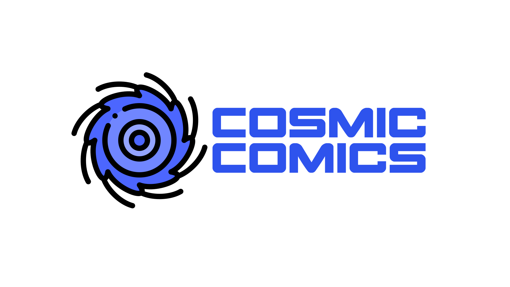

<h1 align="center">
  
</h1>

<h2>CosmicComics</h2>
Read Comics, Manga and Ebooks the easy way
   
   
  <a href="https://github.com/Nytuo/CosmicComics/issues/new?assignees=&labels=bug&template=01_BUG_REPORT.md&title=bug%3A+">Report a Bug</a>
  ·
  <a href="https://github.com/Nytuo/CosmicComics/issues/new?assignees=&labels=enhancement&template=02_FEATURE_REQUEST.md&title=feat%3A+">Request a Feature</a>
    · <a href="https://github.com/Nytuo/CosmicComics/discussions">Ask a Question</a>

 

Table of Contents

- [About](#about)
- [What Cosmic Comics Can Do](#what-cosmic-comics-can-do)
- [Technologies](#technologies)
- [MacOS Troubleshooting](#macos-troubleshooting)
  - [Guided Reading Mode](#guided-reading-mode)
  - [Launching on MacOS](#launching-on-macos)
- [Authors \& contributors](#authors--contributors)
- [License](#license)

---

## About

Cosmic Comics offers a user-friendly interface that makes it easy to browse the collection of comics, manga and ebooks. It supports different file formats, offers adaptive page layout, favorite page marking, advanced search and library management.

## What Cosmic Comics Can Do

- **Read a wide range of formats:**
  - Archives: `CBR`, `CBZ`, `CB7`, `CBT`, `ZIP`, `RAR`, `7z`, `TAR`
  - Documents: `PDF`, `EPUB`
  - Folders containing `PNG`, `JPG`, `JPEG`, `BMP`, and more

- **Browse your collection** with series and books navigation with api fetched / extracted / custom covers.

- **Track your reading progress** — mark books as `Read`, `Unread`, or `Reading`, add them to `Favorites`, and rate them

- **Powerful viewer options:**
  - Zoom, Auto Background Color
  - Double Page Mode, Blank First Page, No Double Page for Horizontal images
  - Manga Mode, Webtoon Mode
  - Fullscreen, Rotations, Bookmarks, Slideshow
  - Sidebar, Hide Menu Bar, Magnifier
  - Guided Reading Mode (Using local AI model)

- **Rich metadata** — display detailed information about your Comics, Manga, and Ebooks

- **Downloaders**
  Cosmic Comics provides some downloaders to get content through the app, you may need subscriptions and credentials to access them.
  - [Marvel Unlimited](https://www.marvel.com/comics/unlimited/home)
  - [MangaDex](https://mangadex.org/)
  - [DC Infinite](https://www.dcuniverseinfinite.com/)
  - [Viz](https://www.viz.com/)
  - [GetComics](https://getcomics.org/)

- **Library metadata provided by multiple APIs:**
  - [Marvel API](https://developer.marvel.com/) (API has shutdown)
  - [Google Books](https://developers.google.com/books)
  - [Anilist](https://anilist.co/)
  - [Metron](https://metron.cloud/)
  - [Open Library](https://openlibrary.org/)
  - Manual entry

- **Continue reading** right where you left off

## Technologies

    
  

  

## Authors & contributors

The original setup of this repository is by [Arnaud BEUX](https://github.com/Nytuo).

For a full list of all authors and contributors, see [the contributors page](https://github.com/Nytuo/CosmicComics/contributors).

## License

CosmicComics is licensed under the **GNU General Public License v3**.
CosmicComics is provided **"as is"** without any **warranty**. Use at your own risk.
See [LICENSE](LICENSE) for more information.
